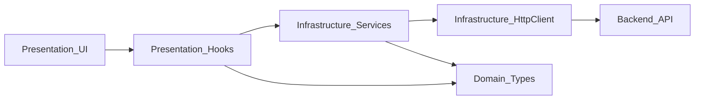

# Proceso lógico para desarrollar el FE (por prioridad y tareas pequeñas)

## Contexto y fuentes

- Estructura objetivo (Clean Architecture): [Estructura de Frontend (React)](https://www.notion.so/13-Estructura-de-Frontend-React-2d0d3a476b2681c99029ecf42e050278)
- Backlog Kanban: [Kanban - Lyfter DnD (Sprints y Tareas)](https://www.notion.so/b450b36b06404f7488cf47d808cb2e2b?v=1c94f9c203ae486ba4557c4dcee05894&p=2d0d3a476b2681be8ee0f967f4258323&pm=s)

## Principio de ejecución (lo que guía el orden)

- Atacar primero los **bloqueos sistémicos**: cliente HTTP, manejo de sesión, routing protegido.
- Cada card se baja a **micro-tareas** con un “check de prueba” inmediato.
- Mantener el flujo Clean Architecture: **presentation → (hook) → infrastructure(api/service) → domain(types)**.

## Fase 0 — Base estable y “smoke test” (muy rápido)

Objetivo: poder correr FE, pegarle al backend y ver errores de red de forma clara.

- Validar que el **health check** funciona end-to-end (ya existe) como primer “vertical slice”.
- Definir convenciones mínimas:
- Dónde van tipos (domain), servicios (infrastructure/api), páginas, componentes, context.
- Contrato de errores (string friendly para UI) y estados loading.

**Prueba rápida**: abrir Home y ejecutar health check; si falla, el error debe ser entendible.

## Fase 1 — Infraestructura HTTP + Auth API (bloqueo principal)

Aquí se desbloquea casi todo el resto.

- Implementar/normalizar el cliente HTTP para soportar:
- **Cookies de refresh** (el backend usa cookie `refresh_token` HttpOnly).
- **Authorization Bearer** con el access token.
- Base URL y paths consistentes.

Notas críticas (por backend):

- `/api/v1/auth/refresh` depende de cookie `refresh_token`.
- Esa cookie está configurada con `secure=True`; en entorno HTTP puro puede no viajar. Si en dev no hay HTTPS, habrá que resolverlo (por gateway/https o ajuste dev en backend).

**Prueba rápida**:

- Llamar login y verificar que el FE recibe `access_token`.
- Llamar refresh y verificar que el request manda cookie (si el entorno lo permite).

## Fase 2 — Domain types de Auth (types primero, UI después)

Esto reduce fricción y mejora DX.

- Definir interfaces TS (User, AuthResponse, LoginCredentials y lo necesario para Register).

**Prueba rápida**: el FE compila sin `any` y el IDE autocompleta bien en servicios y contexto.

## Fase 3 — AuthProvider + Session Rehydration (P0)

Objetivo: que la app “sepa” si hay sesión sin depender de la UI.

- `AuthProvider` mantiene:
- `accessToken` (en memoria), `user` (si aplica), `status` (anonymous/authenticated/loading).
- acciones: `login`, `register`, `logout`, `refreshSession`.
- “Rehydration” en mount:
- pseudocódigo:
    - onMount:
    - setStatus(loading)
    - try refreshSession()
    - setStatus(authenticated | anonymous)

**Prueba rápida**:

- Recargar página: si hay cookie válida, queda authenticated.
- Si no hay cookie, queda anonymous sin romper UI.

## Fase 4 — Routing protegido (P0)

Objetivo: cortar acceso a rutas privadas sin duplicar lógica.

- `ProtectedRoute`:
- si status=loading → placeholder/spinner
- si anonymous → redirect a /login
- si authenticated → render children

**Prueba rápida**: entrar directo a /dashboard sin sesión redirige a /login.

## Fase 5 — Auth UI (P1) (Login/Registro) + navegación

Primero layout, luego integración.

- Login UI Layout (form, CSS variables)
- Login API Integration (usa `authService.login` / `AuthContext.login`)
- Register UI Layout (Name, Username, Email, Password)
- Register API Integration (register + redirect)
- Auth Flow Navigation:
- si authenticated y visitas /login o /register → redirect a dashboard

**Prueba rápida**:

- Login con credenciales válidas → entra a ruta privada.
- Credenciales inválidas → mensaje de error claro.
- Register ok → redirect esperado.

## Fase 6 — Logout (P1)

- Acción de logout:
- llama `/api/v1/auth/logout`
- limpia estado local (accessToken/user/status)
- redirige a /login

**Prueba rápida**: tras logout, rutas privadas vuelven a redirigir.

## Fase 7 — Token rotation / 401 retry (P2)

Esto se hace después de que el “happy path” ya funcione.

- Manejo de 401:
- si request falla por 401:
    - si no hay refresh en curso → iniciar refresh
    - reintentar request original una vez
    - si refresh falla → logout local + redirect

**Prueba rápida**: forzar expiración de access token y confirmar que el usuario no “se cae” (si refresh cookie válida).

## Estrategia de tests (ligera y progresiva)

Sin sobre-ingeniería al inicio:

- **Nivel 1 (siempre)**: pruebas manuales guiadas (checklist por fase).
- **Nivel 2 (a partir de AuthProvider)**:
- tests unitarios de servicios (mock de HTTP)
- tests de componentes clave (ProtectedRoute, LoginPage)
- **Nivel 3 (cuando haya feature core)**: un smoke e2e mínimo.

Pseudocódigo de checklist por PR:

- build ok
- navegar /login, /register
- login ok
- refresh on reload (si entorno lo permite)
- rutas protegidas
- logout

## Orden recomendado (mapeado a tus cards)

- P0 primero:
- FE: Setup React & Folder Structure (Done)
- FE: Auth Context & Provider Implementation
- FE: Session Rehydration (Initial Refresh)
- FE: Protected Routes Wrapper
- P1 después:
- FE: Define Auth Types & Interfaces
- FE: Login Page - UI Layout
- FE: Login Page - API Integration
- FE: Registration Page - UI Layout
- FE: Registration Page - API Integration
- FE: Auth Flow Navigation
- FE: Logout Logic & Integration
- P2:
- FE: Token Rotation (Silent Refresh)